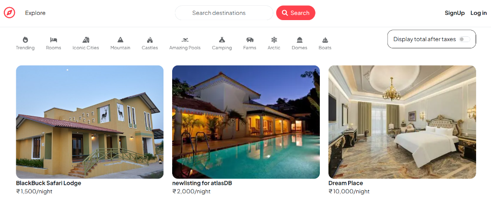
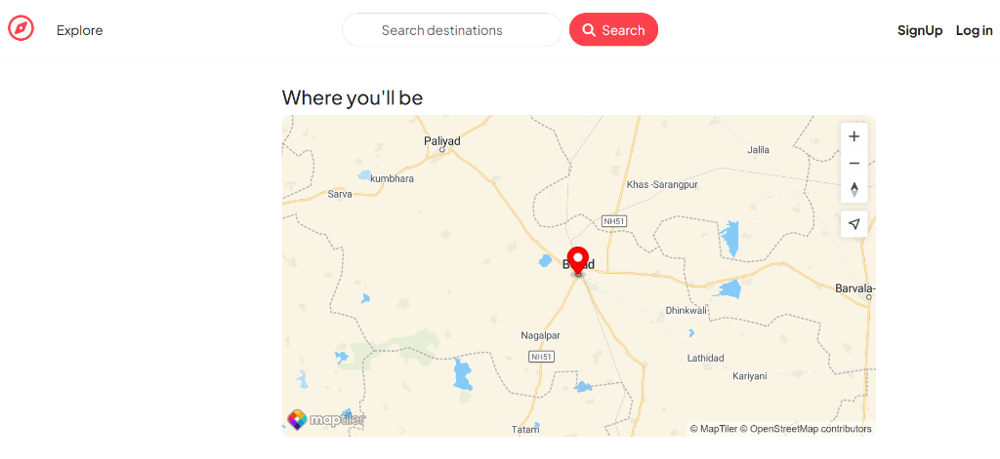
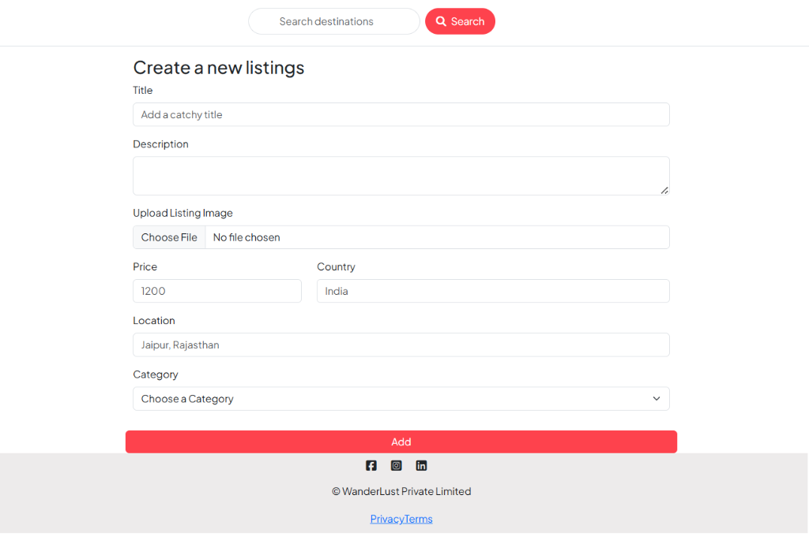
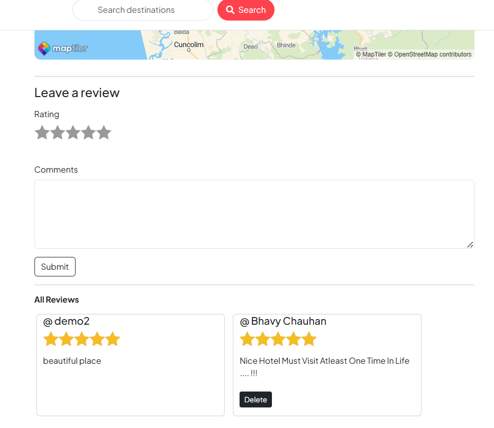

# 🌍 WanderLust

> A modern, full-stack vacation rental & accommodation listing platform inspired by Airbnb. Built with Node.js, Express, MongoDB Atlas, and server-side EJS templates with interactive MapTiler maps and Cloudinary image management.

[](https://delta-project-s1n1.onrender.com/listings)
[](https://nodejs.org/)
[](https://expressjs.com/)
[](https://www.mongodb.com/atlas)
[](https://ejs.co/)
[](https://cloudinary.com/)
[](https://www.maptiler.com/)
[](LICENSE)

---

## 📖 Table of Contents

- [About The Project](#-about-the-project)
- [Key Features](#-key-features)
- [Tech Stack](#-tech-stack)
- [Architecture & Workflow](#-architecture--workflow)
- [Screenshots & UI Preview](#-screenshots--ui-preview)
- [Project Structure](#-project-structure)
- [Getting Started](#-getting-started)
  - [Prerequisites](#prerequisites)
  - [Environment Variables](#environment-variables)
  - [Installation & Local Run](#installation--local-run)
  - [Database Seeding](#database-seeding-optional)
- [Routes Overview](#-routes-overview)
- [Engineering Highlights & Problem Solving](#-engineering-highlights--problem-solving)
- [Quality Assurance & Bug Tracking](#-quality-assurance--bug-tracking)
- [Roadmap & Future Enhancements](#-roadmap--future-enhancements)
- [Author & Acknowledgements](#-author--acknowledgements)

---

## 🧭 About The Project

**WanderLust** is a feature-rich, production-deployed accommodation marketplace designed to connect property owners (hosts) with travelers worldwide. Users can discover verified stays across diverse categories, search destinations by keywords, inspect interactive geolocated maps, read and post 5-star reviews, and manage their own property listings with secure image uploads.

The project is architected using the classic **Model-View-Controller (MVC)** design pattern and demonstrates core full-stack backend fundamentals: robust session management, server-side data validation, token-based map integration, granular authorization guards, and resilient cloud deployments.

---

## ✨ Key Features

- **🏡 Complete Listing Lifecycle (CRUD)**
  - Create, view, edit, and delete vacation listings with title, description, price, location, country, and category.
  - Automatic image optimization and cloud storage using **Cloudinary** via **Multer**.
  - Cascading deletion of associated reviews when a listing is removed.

- **🔍 Smart Search & Category Filters**
  - Instant multi-field regex search across title, location, country, description, and category.
  - 11 curated category filters: *Trending, Rooms, Iconic Cities, Mountain, Castles, Amazing Pools, Camping, Farms, Arctic, Domes, Boats*.
  - **Dynamic Trending Algorithm**: Ranks properties with the highest average star ratings and review volume first.

- **🗺️ Interactive Map & Geocoding Integration**
  - Textual addresses (e.g., `"Ahmedabad, India"`) are automatically geocoded into GeoJSON Point coordinates `[longitude, latitude]` via **MapTiler Geocoding API**.
  - Dynamic 3D interactive map rendering on listing detail pages with custom location pins and informative popups.

- **🔐 Authentication & Role-Based Access Control (RBAC)**
  - User registration, login, and logout powered by **Passport.js (Local Strategy)** with PBKDF2 cryptographic hashing and salting.
  - Route authorization middleware (`isLoggedIn`, `isOwner`, `isReviewAuthor`) preventing unauthorized modifications at both API and UI levels.
  - Context-aware navigation bar and detail page actions (buttons dynamically appear or hide based on user session ownership).

- **⭐ Starability Review System**
  - Interactive 5-star rating widget with detailed textual feedback.
  - Reviews linked to authentic user profiles with author-only deletion permissions.

- **💰 Dynamic Tax Breakdown Toggle**
  - Interactive homepage switch calculating and displaying real-time +18% GST totals for all listed properties.

- **🛡️ Server-Side Validation & Security**
  - Strict schema sanitization with **Joi** preventing invalid or malicious payloads.
  - Centralized custom error handler (`ExpressError`) and asynchronous wrapper (`wrapAsync`).
  - Persistent MongoDB session store (`connect-mongo`) with cookie security and proxy-trust headers.

---

## 🛠️ Tech Stack

### Core Technologies

| Category | Technology | Purpose |
| :--- | :--- | :--- |
| **Runtime Environment** | [Node.js](https://nodejs.org/) (`v20.x`) | Asynchronous server-side JavaScript execution |
| **Backend Framework** | [Express.js](https://expressjs.com/) (`v5.2.1`) | RESTful routing, middleware orchestration, and HTTP request pipeline |
| **Database** | [MongoDB Atlas](https://www.mongodb.com/atlas) & [Mongoose](https://mongoosejs.com/) (`v9.1.1`) | Cloud NoSQL database with Object Document Modeling and schema hooks |
| **Template Engine** | [EJS](https://ejs.co/) (`v3.1.10`) + [ejs-mate](https://github.com/palmer-d/ejs-mate) (`v4.0.0`) | Server-Side Rendering (SSR) with boilerplate layouts and reusable partials |
| **Authentication** | [Passport.js](http://www.passportjs.org/) (`v0.7.0`) + [Passport-Local](https://github.com/jaredhanson/passport-local) | Session-based authentication with local strategy |
| **Password Security** | [Passport-Local-Mongoose](https://github.com/saintedlama/passport-local-mongoose) (`v9.0.1`) | Automated PBKDF2 password hashing, salting, and user serialization |
| **Session & Flash** | [express-session](https://github.com/expressjs/session) (`v1.18.2`) + [connect-mongo](https://github.com/jdesboeufs/connect-mongo) (`v6.0.0`) + [connect-flash](https://github.com/jaredhanson/connect-flash) | Persistent server-side sessions stored in MongoDB Atlas + toast notifications |
| **File Uploads** | [Multer](https://github.com/expressjs/multer) (`v2.0.2`) + [multer-storage-cloudinary](https://github.com/affanshahid/multer-storage-cloudinary) (`v4.0.0`) | Multi-part form data parsing and direct streaming to Cloudinary |
| **Media CDN** | [Cloudinary SDK](https://cloudinary.com/) (`v1.41.3`) | Cloud image storage, dynamic thumbnail transformations, and CDN delivery |
| **Maps & Location** | [MapTiler SDK](https://www.maptiler.com/) (`v4.0.1`) | Forward geocoding API and interactive web map display |
| **Schema Validation** | [Joi](https://joi.dev/) (`v18.0.2`) | Strict schema validation for listings and reviews |
| **UI Framework** | [Bootstrap 5](https://getbootstrap.com/) + [FontAwesome 6](https://fontawesome.com/) + [Starability CSS](https://github.com/LunarLogic/starability) | Responsive grid layout, icon set, and accessible star rating inputs |
| **Deployment Platform** | [Render](https://render.com/) | Live cloud web service deployment behind secure HTTPS reverse proxy |

---

## 🏛️ Architecture & Workflow

WanderLust strictly follows the **Model-View-Controller (MVC)** architectural pattern:

```
                                    ┌───────────────────────┐
                                    │    Client Browser     │
                                    └───────────┬───────────┘
                                                │  HTTP Request (e.g., GET /listings/123)
                                                ▼
                                    ┌───────────────────────┐
                                    │        app.js         │
                                    │   (Express Entry)     │
                                    └───────────┬───────────┘
                                                │  Global Middleware (Session, Passport, Locals)
                                                ▼
                                    ┌───────────────────────┐
                                    │     routes/*.js       │
                                    │   (Express Router)    │
                                    └───────────┬───────────┘
                                                │  Route Guards (isLoggedIn, isOwner, Joi Validation)
                                                ▼
                                    ┌───────────────────────┐
                                    │  controller/*.js      │
                                    │   (Business Logic)    │
                                    └──────┬─────────┬──────┘
                   GeoJSON Query           │         │ Image Upload Stream
          ┌────────────────────────────────┘         └────────────────────────────────┐
          ▼                                                                           ▼
┌──────────────────┐               ┌───────────────────────┐               ┌──────────────────┐
│   MapTiler API   │               │      models/*.js      │               │  Cloudinary CDN  │
│ (Geocoding / SDK)│               │   (Mongoose ODM)      │               │ (Image Storage)  │
└──────────────────┘               └───────────┬───────────┘               └──────────────────┘
                                               │ Database Mutations / Queries
                                               ▼
                                   ┌───────────────────────┐
                                   │   MongoDB Atlas DB    │
                                   └───────────┬───────────┘
                                               │ Document Result
                                               ▼
                                   ┌───────────────────────┐
                                   │     views/**/*.ejs    │
                                   │ (ejs-mate SSR Engine) │
                                   └───────────┬───────────┘
                                               │ Rendered HTML Document
                                               ▼
                                   ┌───────────────────────┐
                                   │    Client Browser     │
                                   └───────────────────────┘
```

### 🖼️ Image Upload Pipeline
1. Client selects an image in the create/edit listing form.
2. `Multer` intercepts the multi-part request using `CloudinaryStorage`.
3. The image is uploaded directly to the `wanderlust_DEV` folder in Cloudinary.
4. Cloudinary returns a secure URL and filename identifier, which Mongoose stores in the listing document.

---

## 📸 Screenshots & UI Preview

| **Explore / All Listings Page** | **MapTiler Interactive Map** |
| :---: | :---: |
|  <br> *(Filterable listings grid with tax toggle)* |  <br> *(Interactive MapTiler map with location pin)* |

| **Create New Listing Form** | **Leave a Review & Reviews Section** |
| :---: | :---: |
|  <br> *(Category dropdown & Cloudinary image upload)* |  <br> *(Starability 5-star ratings with review controls)* |

---

## 📁 Project Structure

```
MAJORPROJECT/
├── app.js                         # Application entrypoint (Middleware stack, DB connection, routing)
├── cloudConfig.js                 # Cloudinary SDK and Multer Storage engine configuration
├── middleware.js                  # Route protection middlewares (isLoggedIn, isOwner, isReviewAuthor, Joi validation)
├── schema.js                      # Joi validation schemas for Listings & Reviews
├── package.json                   # Dependencies, engines, and project scripts
├── .gitignore                     # Git ignored paths (node_modules, .env)
├── README.md                      # Project documentation and architecture guide
│
├── screenshots/                   # Application preview screenshots for documentation
│   ├── explore-listings.png       # Explore / All listings feed preview
│   ├── maptiler-map.png           # MapTiler interactive map preview
│   ├── create-listing.png         # Create listing form preview
│   └── reviews-section.png        # Leave review & all reviews preview
│
├── controller/                    # Business Logic Layer (MVC Controllers)
│   ├── listing.js                 # Listings CRUD, search algorithm, and geocoding logic
│   ├── reviews.js                 # Review creation and deletion handlers
│   └── user.js                    # User registration, login session, and logout handlers
│
├── models/                        # Data Layer (Mongoose Schemas & Hooks)
│   ├── listing.js                 # Listing schema with GeoJSON, owner ref, and cascade delete hook
│   ├── reviews.js                 # Review schema with rating, comment, and author ref
│   └── user.js                    # User schema integrated with Passport-Local-Mongoose
│
├── routes/                        # Route Endpoint Definitions
│   ├── listings.js                # /listings resource endpoints
│   ├── review.js                  # /listings/:id/reviews nested review endpoints
│   └── user.js                    # /signup, /login, /logout endpoints
│
├── views/                         # Presentation Layer (EJS Server-Rendered Views)
│   ├── layouts/
│   │   └── boilerplate.ejs        # Master layout wrapper (HTML structure, Navbar, Flash, Footer)
│   ├── includes/
│   │   ├── navbar.ejs             # Sticky navigation bar with search and dynamic auth links
│   │   ├── flash.ejs              # Toast alert banner for success and error flash messages
│   │   └── footer.ejs             # Application footer with privacy, terms, and social links
│   ├── listings/
│   │   ├── index.ejs              # Main explore feed with category filter bar and tax toggle
│   │   ├── show.ejs               # Detailed listing page with MapTiler map and review section
│   │   ├── new.ejs                # Form for hosting a new property
│   │   └── edit.ejs               # Form for editing existing property details
│   ├── users/
│   │   ├── signup.ejs             # User registration form
│   │   └── login.ejs              # User login form
│   ├── error.ejs                  # Generic error handler view
│   ├── privacy.ejs                # Static Privacy Policy page
│   └── terms.ejs                  # Static Terms & Conditions page
│
├── public/                        # Static Client-Side Assets
│   ├── css/
│   │   ├── style.css              # Custom styling, card hover effects, and responsive adjustments
│   │   └── rating.css             # Starability star rating widget stylesheets
│   └── js/
│       ├── map.js                 # Client-side MapTiler SDK initialization, geocoding & markers
│       └── script.js              # Client-side Bootstrap form validation script
│
├── init/                          # Database Seeder Scripts
│   ├── data.js                    # Sample dataset of vacation listings
│   └── index.js                   # Seeder script to initialize/reset the MongoDB database
│
└── utils/                         # Error Handling Utilities
    ├── ExpressError.js            # Custom Error class with HTTP status code support
    └── wrapasync.js               # Async utility wrapper to catch unhandled Promise rejections
```

---

## 🚀 Getting Started

Follow these steps to run WanderLust locally on your machine.

### Prerequisites

- **Node.js** (v18.x or v20.x recommended) - [Download Node.js](https://nodejs.org/)
- **npm** (comes bundled with Node.js)
- **MongoDB** (Local instance or free [MongoDB Atlas](https://www.mongodb.com/cloud/atlas) cluster)
- **Cloudinary Account** (Free tier for media uploads) - [Sign Up](https://cloudinary.com/)
- **MapTiler Account** (Free API key for map rendering) - [Sign Up](https://www.maptiler.com/)

---

### Environment Variables

Create a `.env` file in the root directory and add the following keys:

```env
# MongoDB Connection String (Atlas or Local)
ATLASDB_URL=mongodb+srv://<username>:<password>@cluster0.mongodb.net/wanderlust?retryWrites=true&w=majority

# Session Encryption Secret
SECRET=your_super_secret_session_key

# Cloudinary Credentials
CLOUD_NAME=your_cloudinary_cloud_name
CLOUD_API_KEY=your_cloudinary_api_key
CLOUD_API_SECRET=your_cloudinary_api_secret

# MapTiler API Token
MAP_TOKEN=your_maptiler_api_key

# Environment Mode
NODE_ENV=development
```

---

### Installation & Local Run

1. **Clone the repository:**
   ```bash
   git clone https://github.com/yogingohil/delta-project.git
   cd delta-project
   ```

2. **Install project dependencies:**
   ```bash
   npm install
   ```

3. **Start the local server:**
   ```bash
   node app.js
   ```
   *(Or use `npx nodemon app.js` for automatic server reloads during development)*

4. **Access the application:**
   Open your browser and navigate to:
   ```
   http://localhost:8080/listings
   ```

---

### Database Seeding (Optional)

To seed your database with sample destination listings:

```bash
node init/index.js
```

---

## 🛣️ Routes Overview

<details>
<summary><b>View RESTful API Route Endpoints Table</b></summary>

<br>

### Listing Routes (`/listings`)

| HTTP Method | Endpoint | Middleware / Guards | Description |
| :--- | :--- | :--- | :--- |
| `GET` | `/listings` | None | Displays all listings (supports `?category=` and `?q=` search) |
| `GET` | `/listings/new` | `isLoggedIn` | Renders form to create a new listing |
| `POST` | `/listings` | `isLoggedIn`, `upload.single()`, `validateListing` | Uploads image to Cloudinary, geocodes address, and creates listing |
| `GET` | `/listings/:id` | None | Displays detailed view of a single listing with Map and Reviews |
| `GET` | `/listings/:id/edit` | `isLoggedIn`, `isOwner` | Renders edit form pre-populated with existing listing data |
| `PUT` | `/listings/:id` | `isLoggedIn`, `isOwner`, `upload.single()`, `validateListing` | Updates listing details and optionally replaces photo/coordinates |
| `DELETE` | `/listings/:id` | `isLoggedIn`, `isOwner` | Deletes listing and triggers cascading deletion of attached reviews |

### Review Routes (`/listings/:id/reviews`)

| HTTP Method | Endpoint | Middleware / Guards | Description |
| :--- | :--- | :--- | :--- |
| `POST` | `/listings/:id/reviews` | `isLoggedIn`, `validateReview` | Creates a new star rating review linked to the current user |
| `DELETE` | `/listings/:id/reviews/:reviewId` | `isLoggedIn`, `isReviewAuthor` | Deletes a review (restricted to original review author only) |

### User & Authentication Routes (`/`)

| HTTP Method | Endpoint | Middleware / Guards | Description |
| :--- | :--- | :--- | :--- |
| `GET` | `/signup` | None | Renders user registration form |
| `POST` | `/signup` | None | Registers user, hashes password, and automatically logs in |
| `GET` | `/login` | None | Renders user login form |
| `POST` | `/login` | `saveRedirectUrl`, `passport.authenticate` | Authenticates credentials and redirects to intended or default page |
| `GET` | `/logout` | `isLoggedIn` | Destroys user session and redirects to explore page |

### Static Pages (`/`)

| HTTP Method | Endpoint | Middleware / Guards | Description |
| :--- | :--- | :--- | :--- |
| `GET` | `/` | None | Redirects root traffic directly to `/listings` |
| `GET` | `/privacy` | None | Displays static Privacy Policy page |
| `GET` | `/terms` | None | Displays static Terms & Conditions page |

</details>

---

## 💡 Engineering Highlights & Problem Solving

During the development and deployment of WanderLust, several non-trivial architectural and production challenges were resolved:

1. **Persistent Session Handling on Cloud Reverse Proxies:**
   - *Problem:* When deployed on Render (behind HTTPS load balancers), login sessions were prematurely dropped upon page redirects because session cookies were missing proxy trust and had integer-based timestamp expiration values.
   - *Solution:* Configured `app.set("trust proxy", 1)`, set `cookie.expires` to valid `Date` objects, and added explicit `req.session.save()` callback handlers before HTTP redirects in authentication controllers to guarantee database writes completed prior to response dispatch.

2. **Automated Cascading Deletion in NoSQL:**
   - *Problem:* Deleting a listing in MongoDB left disconnected review documents in the database.
   - *Solution:* Implemented a Mongoose `findOneAndDelete` post-hook on `listingSchema` that invokes `Review.deleteMany({ _id: { $in: listing.reviews } })`, maintaining referential integrity across collections.

3. **Resilient Geocoding & Mapping Pipeline:**
   - *Problem:* Incomplete address inputs could cause map rendering to fail or crash page scripts.
   - *Solution:* Built server-side geocoding validation with fallback coordinates `[78.9629, 20.5937]`, paired with client-side error handling in `public/js/map.js` to gracefully fall back to geocoding or default pins without breaking the UI.

4. **Multi-Field Case-Insensitive Search & Ranking:**
   - *Problem:* Users needed to search across diverse attributes (destination city, property title, category) while allowing "Trending" to rank properties by quality.
   - *Solution:* Engineered a dynamic `$or` regex query combining text fields and category filters with an in-memory aggregation sort calculating average review ratings for the "Trending" view.

---

## 🧪 Quality Assurance & Bug Tracking

WanderLust follows a structured testing and quality assurance methodology. The repository maintains an active bug-tracking log to systematically verify security boundaries, layout rendering integrity, session stability, and cross-browser responsiveness across all user journeys.

---

## 🔮 Roadmap & Future Enhancements

- [ ] **Reservation & Booking Engine:** Real-time date-range calendar picker with booking confirmations.
- [ ] **Payment Gateway Integration:** Secure payment processing with Stripe / Razorpay.
- [ ] **User Profile & Host Dashboard:** Analytics for hosts to monitor listing views, earnings, and booking requests.
- [ ] **Wishlist & Favorites:** Ability for travelers to save favorite properties to custom collections.
- [ ] **Direct Host Messaging:** In-app chat between travelers and hosts.

---

## 👨‍💻 Author & Acknowledgements

**Yogin Gohil**
- **Live Project:** [WanderLust Live on Render](https://delta-project-s1n1.onrender.com/listings)
- **GitHub Profile:** [@yogingohil](https://github.com/yogingohil)
- **Repository:** [delta-project](https://github.com/yogingohil/delta-project)

*This project was built as a capstone full-stack web development project to demonstrate deep mastery of Node.js, Express, MongoDB, RESTful API architecture, authentication, and cloud deployments.*

---
<p align="center">Made with ❤️ by Yogin Gohil • Licensed under the ISC License</p>
